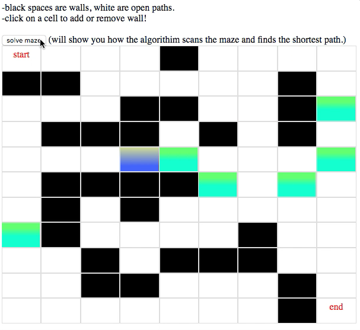

# mazeSolver
This app allows you to to construct mazes and choose a pathfinding algorithim to solve them: Dijkstras algorithim or A* Search

TO USE: Please clone down repo and open index.html.

Link to video:
https://youtu.be/QmyP52pU5Zc

